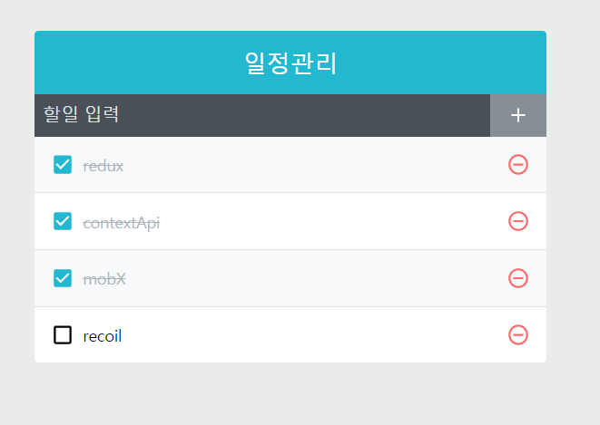

# React-Redux를 사용하여 TodoList를 작성했습니다.

## <기술스택>   React , React-Redux , SCSS

•	<b>작품소개<b/> : React-Redux를 사용하여 TodoList를 개발해보았습니다. 
   Redux를 Ducks 패턴을 이용해서 리듀서와 액션 관련 코드들을 하나의 파일에 몰아서 개발했습니다.
    Style은 SCSS를 이용해 스타일을 입혀서 개발했습니다.

### [웹페이지 바로가기](https://wondonghwi.github.io/React_Redux_TodoList/)

( Preview )  

